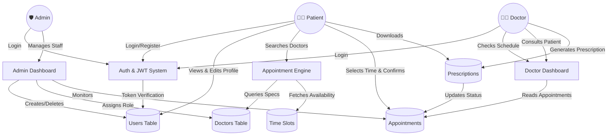

# Hospital Management System (HMS) — Architecture & Data Flow Guide

Welcome to the HMS Architecture Guide. This document provides a comprehensive overview of the database design and the flow of data between the various actors (Patients, Doctors, Admins) within the system.

---

## 1. Data Flow Diagram

The following diagram illustrates how the three main roles interact with the system's core capabilities.

---

## 2. Database Schema

The backend uses a normalized MySQL database structure. Below are the 5 core tables that power the application, along with all their parameters.

### `users`
Acts as the central authentication and profile table for **all** roles (Patients, Doctors, Admins).
* `id` *(INT)*: Primary Key.
* `name` *(VARCHAR)*: Full name of the user.
* `guardian_name` *(VARCHAR)*: Optional Father/Spouse name.
* `gender` *(ENUM)*: 'male', 'female', 'other'.
* `age` *(INT)*: Patient age.
* `weight` *(DECIMAL)*: Patient weight in kg.
* `email` *(VARCHAR)*: Unique identifier for login.
* `password` *(VARCHAR)*: Bcrypt hashed password.
* `role` *(ENUM)*: Determines access level — 'patient', 'doctor', or 'admin'.
* `phone` *(VARCHAR)*: Contact number.
* `address` *(VARCHAR)*: Street address.
* `city` *(VARCHAR)*: Residential city.
* `medical_history` *(TEXT)*: Pre-existing conditions (for patients).
* `created_at` *(TIMESTAMP)*: Record creation time.

### `doctors`
Stores specialized professional details for users assigned the `doctor` role. Maps 1-to-1 with a specific `user`.
* `id` *(INT)*: Primary Key.
* `user_id` *(INT)*: Foreign Key referencing `users(id)`.
* `specialization` *(VARCHAR)*: Medical branch (e.g., Cardiology, Neurology).
* `experience_years` *(INT)*: Years of practice.
* `qualifications` *(VARCHAR)*: Degrees (e.g., MBBS, MD).
* `fees` *(DECIMAL)*: Consultation fee (e.g., ₹500).
* `created_at` *(TIMESTAMP)*: Record creation time.

### `doctor_slots`
Represents the 15-minute intervals when a doctor is available for consultation.
* `id` *(INT)*: Primary Key.
* `doctor_id` *(INT)*: Foreign Key referencing `doctors(id)`.
* `date` *(DATE)*: The date of the slot (e.g., 2026-04-10).
* `time` *(TIME)*: The 15-minute slot start time (e.g., 09:15:00).
* `is_booked` *(BOOLEAN)*: Flag to indicate if the slot is taken (true/false).
* `created_at` *(TIMESTAMP)*: Record creation time.

### `appointments`
The core transactional table linking a Patient, a Doctor, and a Specific Slot.
* `id` *(INT)*: Primary Key.
* `patient_id` *(INT)*: Foreign Key referencing `users(id)`.
* `doctor_id` *(INT)*: Foreign Key referencing `doctors(id)`.
* `slot_id` *(INT)*: Foreign Key referencing `doctor_slots(id)`. Unique constraint to prevent double-booking.
* `status` *(ENUM)*: Current state — 'pending', 'completed', or 'cancelled'.
* `reason` *(VARCHAR)*: The reason for visit (specifically used for "General Medicine" consultations).
* `created_at` *(TIMESTAMP)*: Record creation time.

### `prescriptions`
Created post-consultation by the doctor, linking generated PDFs/notes to a specific appointment.
* `id` *(INT)*: Primary Key.
* `appointment_id` *(INT)*: Foreign Key referencing `appointments(id)`. Unique to guarantee one prescription per visit.
* `doctor_id` *(INT)*: Foreign Key referencing `doctors(id)`.
* `patient_id` *(INT)*: Foreign Key referencing `users(id)`.
* `notes` *(TEXT)*: General medical observations or text advice.
* `file_url` *(VARCHAR)*: Absolute path/URL to the uploaded PDF file.
* `created_at` *(TIMESTAMP)*: Record creation time.
